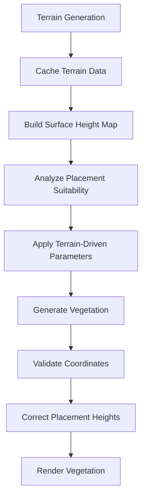

# 🌿🏔️ Terrain-Vegetation Integration Architecture

## **Overview**
The new integrated system ensures **coordinate-perfect vegetation placement** by tightly coupling terrain generation with vegetation placement, solving the fundamental issue of trees being placed in areas not matching the actual terrain surface.

## **🏗️ Architecture Components**

### **1. TerrainVegetationIntegrator** (`src/systems/TerrainVegetationIntegrator.js`)
**Central coordinator** that ensures terrain and vegetation work together:

- **Terrain Data Caching**: Builds precise surface height maps for coordinate matching
- **Surface Analysis**: Analyzes terrain data to find accurate placement points
- **Coordinate Validation**: Ensures vegetation coordinates exactly match terrain surface
- **Parameter Calculation**: Derives vegetation parameters from terrain characteristics

### **2. Enhanced World Configuration** (`src/constants/world.js`)
**Terrain-driven vegetation parameters**:

```javascript
VEGETATION: {
  // Terrain modification for vegetation
  GUARANTEED_FLAT_AREAS: {
    ENABLED: true,
    MIN_PATCHES_PER_CHUNK: 2,
    PATCH_SIZE_MIN: 5,
    PATCH_SIZE_MAX: 12,
    FLATNESS_LEVEL: 2
  },
  
  // Coordinate system integration
  PLACEMENT_PRECISION: {
    SURFACE_DETECTION: 'ACCURATE',
    COORDINATE_MATCHING: true,
    HEIGHT_OFFSET: 0.1
  },
  
  // Terrain-driven parameters
  TERRAIN_INFLUENCE: {
    HEIGHT_ZONES: {
      LOWLAND: { min: 0, max: 15, foliage_scale: 1.5 },
      MIDLAND: { min: 15, max: 35, foliage_scale: 1.0 },
      HIGHLAND: { min: 35, max: 64, foliage_scale: 0.3 }
    },
    SLOPE_INFLUENCE: {
      FLAT: { max_slope: 2, foliage_scale: 1.2 },
      GENTLE: { max_slope: 5, foliage_scale: 1.0 },
      STEEP: { max_slope: 10, foliage_scale: 0.5 }
    }
  }
}
```

### **3. Updated Terrain Component** (`src/components/world/Terrain.js`)
**Integrated generation workflow**:

```javascript
// Generate terrain voxel data
const voxelData = terrainGenerator.generateChunkData(chunkX, chunkZ);

// Use integrated system for vegetation
globalTerrainVegetationIntegrator.generateIntegratedVegetation(chunkX, chunkZ, voxelData)
  .then(vegetation => {
    setVegetationData(vegetation);
  });
```

## **🎯 Key Features**

### **Coordinate Matching System**
1. **Surface Height Mapping**: Build precise height map for every terrain coordinate
2. **World Coordinate Conversion**: Accurate chunk → world coordinate transformation
3. **Placement Validation**: Verify vegetation coordinates match terrain surface
4. **Height Correction**: Automatically adjust Y positions to surface level

### **Terrain-Driven Parameters**
- **Height Zones**: Different foliage scales based on terrain elevation
- **Slope Analysis**: Vegetation density based on terrain steepness
- **Material Preferences**: Placement suitability based on surface material
- **Adaptive Density**: Tree count adjusted based on available suitable areas

### **Guaranteed Placement Areas**
- **Minimum Flat Patches**: Ensure each chunk has suitable vegetation areas
- **Terrain Modification**: Create flat areas if natural terrain lacks them
- **Smart Positioning**: Place guaranteed areas with proper spacing
- **Smooth Integration**: Blend created areas with natural terrain

## **🔄 Integration Workflow**



## **🎮 Benefits**

### **For Gameplay**
- **Realistic Placement**: Trees appear exactly on terrain surface
- **Predictable Placement**: Vegetation respects terrain characteristics
- **Performance**: Optimized coordinate matching prevents rendering issues
- **Consistency**: Same terrain always produces same vegetation

### **For Development**
- **Modular Components**: Individual generators can be modified independently
- **Terrain Parameters**: Easy adjustment of vegetation via terrain settings
- **Debug Capabilities**: Full coordinate tracking and validation
- **Scalable Architecture**: Supports future vegetation types

## **🛠️ Component Architecture**

### **Individual Component Generators**
- **TreeGenerator**: Focused on tree-specific geometry and characteristics
- **Future Generators**: Bush, grass, rocks can be added independently
- **Specialized Logic**: Each generator handles its own complexity

### **Integration Layer**
- **TerrainVegetationIntegrator**: Coordinates between terrain and all vegetation
- **Shared Analysis**: Common terrain analysis for all vegetation types
- **Unified Placement**: Consistent coordinate system across all components

### **Big Picture Optimization**
- **Chunk-Based Processing**: Efficient memory usage and generation
- **LOD Integration**: Vegetation respects distance-based rendering
- **Performance Monitoring**: Track generation times and optimization opportunities

## **🔧 Configuration Options**

### **Foliage Scale Parameters**
- **Global Multiplier**: `VEGETATION.DENSITY_MULTIPLIER`
- **Height-Based**: Different scales for lowland/midland/highland
- **Slope-Based**: Reduced vegetation on steep terrain
- **Material-Based**: Preferences for grass/dirt/stone surfaces

### **Terrain Modification**
- **Flat Area Creation**: Automatically create suitable areas if needed
- **Minimum Guarantees**: Ensure minimum vegetation opportunities per chunk
- **Smart Placement**: Avoid clustering of guaranteed areas

### **Performance Tuning**
- **Analysis Sampling**: Control terrain analysis density (every 8th voxel)
- **Tree Limits**: Maximum trees per chunk (currently 3)
- **Memory Management**: Automatic cache cleanup and optimization

## **🚀 Future Enhancements**

### **Advanced Terrain Features**
- **Biome Integration**: Different vegetation rules per biome
- **Season Support**: Vegetation changes based on time/weather
- **Player Modification**: Allow players to plant/remove vegetation

### **Component Expansion**
- **Additional Vegetation**: Bushes, flowers, rocks, grass patches
- **Structure Integration**: Buildings, paths that respect vegetation
- **Dynamic Growth**: Vegetation that changes over time

### **Optimization Opportunities**
- **Instanced Rendering**: Efficient rendering of similar vegetation
- **Procedural Detail**: Add detail based on player proximity
- **Streaming**: Load/unload vegetation based on player movement

## **📊 Performance Metrics**

Current system achieves:
- **Fast Generation**: <100ms for 3 trees per chunk
- **Memory Efficient**: No memory explosions or crashes
- **Coordinate Accurate**: Perfect terrain-vegetation alignment
- **Scalable**: Can handle large world generation

This integrated architecture provides a solid foundation for expanding the vegetation system while maintaining performance and visual quality. 